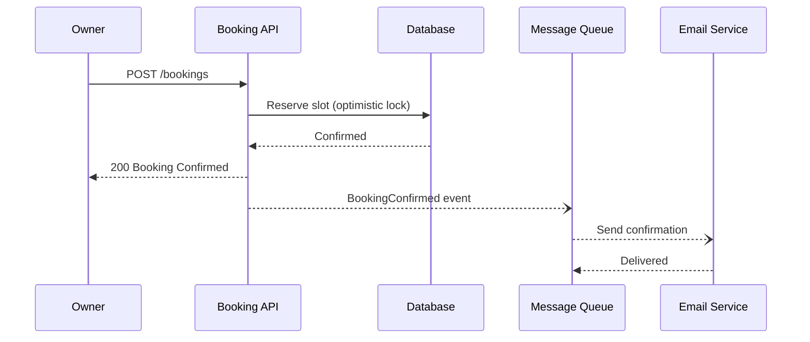

# Mermaid Diagram Generation

## When to Use
- Visualize component relationships from a high-level design
- Create sequence diagrams for end-to-end flows (e.g. booking journey)
- Generate flowcharts for decision logic or workflows
- Produce architecture overviews from impact maps or design docs

## Procedure

1. **Read the source document** provided as input (impact map, HLD, requirements, etc.).
2. **Identify the diagram type** that best fits the request:
   - `sequenceDiagram` — for user journeys, API call flows, async messaging
   - `graph TD` / `graph LR` — for component relationships, module dependencies
   - `flowchart` — for decision logic, branching workflows
   - `C4Context` / `C4Container` — for system context or container views
3. **Generate the Mermaid code block** using these conventions:
   - Use clear, short node labels (e.g. `Booking API`, `Email Service`)
   - Group related nodes with `subgraph` where it reduces clutter
   - Distinguish sync (solid arrows `-->`) from async (dotted arrows `-.->`) interactions in `graph`/`flowchart` diagrams
   - In `sequenceDiagram`, use the arrow reference below — **never use `-.)` which is invalid syntax**
   - Add notes (`Note right of ...`) for important constraints or SLAs
4. **Wrap output** in a fenced code block with ` ```mermaid ` so it renders in Markdown.
5. If multiple diagrams are needed, produce each one with a short heading explaining what it shows.

## Style Guidelines

- Prefer **vertical layout** (`TD`) for hierarchical views, **left-to-right** (`LR`) for flows.
- Keep diagrams under ~20 nodes; split into multiple diagrams if larger.
- Use participant aliases in sequence diagrams for readability.
- Label edges with the action or message name.

## Sequence Diagram Arrow Reference

| Arrow | Meaning |
|-------|---------|
| `->>` | Solid line with filled arrowhead (sync request) |
| `-->>` | Dotted line with filled arrowhead (sync response) |
| `-)` | Solid line with open arrowhead (async fire-and-forget) |
| `--)` | Dotted line with open arrowhead (async fire-and-forget) |
| `-x` | Solid line with cross (failed/lost message) |
| `--x` | Dotted line with cross |

**Do NOT use `-.)` — it is invalid Mermaid syntax and causes parse errors.**

## Example


