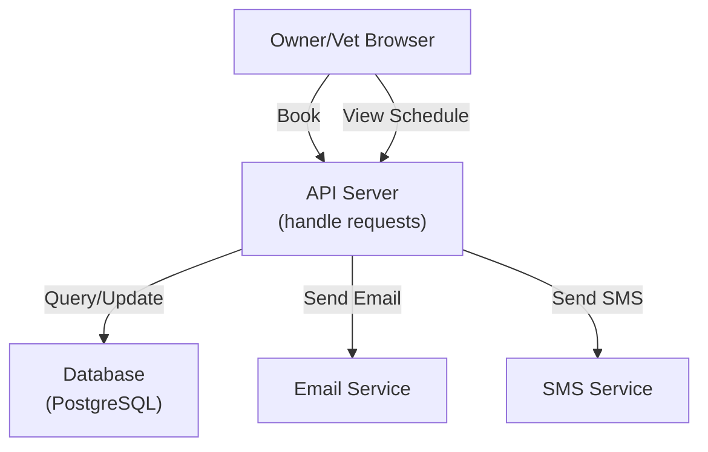

# Exercise 2: Design Architecture from Requirements

## ⏱️ Time: 20 minutes

---

## 🎯 Goal

Use Copilot to generate a system architecture based on the requirements and your understanding from Exercise 1.

---

## 📖 Context

Now that you understand **what** to build (from Exercise 1), it's time to design **how** to build it.

**Architecture** answers:
- What services/components do we need?
- How do they communicate?
- What's the data flow?
- Where do we store data?

You'll use Copilot to generate an architecture diagram and documentation.

---

## 📋 Tasks

### Task 0 (Optional): Create Architecture Design Instructions

Create `.architecture-instructions.md` to guide Copilot's architecture design:

```markdown
# Architecture Design Instructions

You are a software architect. When designing system architectures:

1. **Always include these components**:
   - Frontend (what UI/client sees)
   - API Layer (endpoints and controllers)
   - Business Logic (services)
   - Data Layer (storage)
   - External Systems (integrations)

2. **For each component, specify**:
   - Its purpose (1-2 sentences)
   - What data it handles
   - What components it communicates with
   - Key technologies (if known)

3. **Always provide**:
   - Text-based component list (before diagram)
   - Mermaid diagram (visual architecture)
   - Data flow description
   - List of all external systems

4. **Keep diagrams simple**:
   - Max 6-8 components
   - Use clear labels
   - Show all data flows
   - Highlight external APIs

5. **Format output**:
   - Components section (bullet list)
   - Architecture diagram (Mermaid)
   - API endpoints (REST list)
   - Data flow diagram (Mermaid sequence)
```

---

### Task 1: Generate System Architecture Components

Ask Copilot:

```
Using my .architecture-instructions.md guidelines:

Based on the appointment booking requirements I analyzed earlier, design the system architecture.

Identify:
1. **Frontend**: What UI does owner/vet use?
2. **API Layer**: What endpoints are needed? (POST /appointments, GET /slots, etc.)
3. **Business Logic**: What services handle core logic? (BookingService, SlotService, etc.)
4. **Data Layer**: What entities are stored? (Appointments, Slots, Owners, Vets, etc.)
5. **External Systems**: Email, SMS providers

For each component, list:
- What it does
- What data it handles
- What other components it talks to

Keep it simple - max 5-6 main components.
```

**What to expect:**
Copilot will follow your instruction format, providing consistent structure.

---

### Task 2: Create Architecture Diagram

Ask Copilot:

```
Now draw that architecture as a Mermaid diagram.

Show:
1. Frontend (Web)
2. API Gateway/Controller
3. Services (BookingService, SlotService, NotificationService)
4. Database
5. External APIs (Email, SMS)

Use arrows to show data flow. Example format:

\`\`\`mermaid
graph TB
    Client["Web Browser"]
    API["API Server"]
    DB["Database"]
    Email["Email Service"]
    
    Client -->|Book Appointment| API
    API -->|Query/Store| DB
    API -->|Send Confirmation| Email
\`\`\`
```

**What to expect:**
- A Mermaid diagram showing components and connections
- You can copy-paste this into a markdown file and preview it

---

### Task 3: Define API Endpoints

Ask Copilot:

```
What REST API endpoints do we need for the appointment booking system?

List them in this format:
- GET /slots?date=2024-01-15&vetId=123 → Returns available slots
- POST /appointments → Creates new appointment
- GET /appointments/{id} → Gets appointment details
- etc.

Include:
- HTTP method and path
- What parameters it takes
- What it returns
- Success HTTP status code
```

**What to expect:**
- 6-10 API endpoint definitions
- Clear HTTP methods, paths, parameters
- Response status codes

---

### Task 4: Data Flow Diagram

Ask Copilot:

```
Draw a sequence diagram showing the appointment booking flow.

Scenario: Owner books an appointment

Actors:
- Owner (web browser)
- API Server
- Database
- Email Service

Steps:
1. Owner clicks "Book Appointment" on UI
2. UI sends request to API
3. API checks if slot is available
4. API creates appointment record
5. API sends email notification
6. Owner sees success message

Draw this as a Mermaid sequence diagram.
```

**What to expect:**
- A sequence diagram showing time flow
- Actors and messages between them
- Clear success path

---

## 💡 Sample Architecture Output

Here's what Copilot might generate:

**Components:**
```
1. Frontend (React/Vue)
   - Owner login & booking UI
   - Vet schedule view
   
2. API Server (Node.js/Python/.NET)
   - Handles all business logic
   - Validates bookings
   
3. Database (PostgreSQL)
   - Stores owners, pets, vets, appointments, slots
   
4. Notification Service
   - Sends email confirmations
   - Sends SMS confirmations
   
5. External APIs
   - SendGrid/Mailgun for email
   - Twilio for SMS
```

**Architecture Diagram:**


---

## 📊 Deliverables

Save your outputs to `outputs/exercise-2-architecture.md`:

```markdown
# Exercise 2: System Architecture

## Architecture Components
[Component list with descriptions]

## Architecture Diagram
[Copilot's Mermaid diagram]

## API Endpoints
[List of REST endpoints]

## Data Flow: Booking Flow
[Sequence diagram showing appointment booking]

## Key Design Decisions
[Why did you choose this architecture?]
```

---

## 💡 Best Practices: Instructions for Architecture Quality

**Why instruction files help for architecture:**
- ✅ Ensures all diagrams follow same style
- ✅ Guarantees all components are identified
- ✅ Consistent formatting (Mermaid, ASCII, etc.)
- ✅ Never miss external systems or integrations
- ✅ Reusable for all future architecture projects

**Instruction File Checklist:**
- [ ] Component list always included?
- [ ] Diagram always in Mermaid format?
- [ ] Data flow always explained?
- [ ] External systems always shown?
- [ ] No assumption about technology (keep generic)?

---

## ✅ Success Criteria

Your architecture succeeds if:

- [ ] You have 5-7 main components
- [ ] Data flow is clear (owner → API → database → email)
- [ ] All 4 main features are covered (search, book, notify, view schedule)
- [ ] API endpoints align with features
- [ ] External systems (email, SMS) are included
- [ ] You can explain why each component exists
- [ ] Did you create .architecture-instructions.md file? (Recommended!)

---

## 🔍 Review Questions

After completing this exercise, ask yourself:

1. **Completeness**: Does the architecture cover all requirements?
2. **Simplicity**: Is it simple enough to understand?
3. **Scalability**: Could it handle 1,000 bookings/day?
4. **Reliability**: What could break? How would we fix it? (Note: We'll address this in Exercise 3)

---

## 🎓 What You're Learning

✅ How to translate requirements into architecture
✅ How to use Copilot to generate diagrams (Mermaid)
✅ How to define API contracts
✅ How to think about data flow
✅ How to validate completeness

---

## 🚀 Next Step

Now that you have an architecture, it's time to **make technology decisions**.

→ [Exercise 3: Technology Selection Based on Architecture](./03-technology-selection.md)
