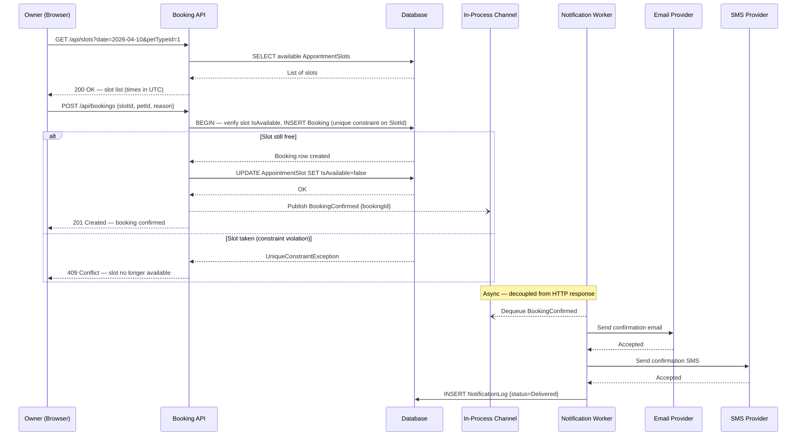
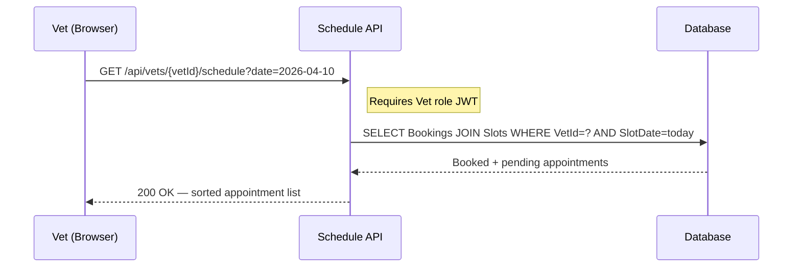

# High-Level Design: Appointment Booking System

**Traceability:** [Impact Map](./impact-map.md) · [Requirements](../requirements.md)

---

## 1. Major Components and Responsibilities

### Component Overview

```mermaid
graph TD
    subgraph Client["Web Client (Browser)"]
        UI[Owner / Vet UI]
    end

    subgraph API["ASP.NET Core REST API"]
        Auth[Auth Controller\n/auth/login]
        Slots[Slot Controller\n/api/slots]
        Bookings[Booking Controller\n/api/bookings]
        Schedule[Schedule Controller\n/api/vets/{id}/schedule]
        NW[Notification Worker\nBackgroundService]
    end

    subgraph Data["Data Layer (EF Core)"]
        DB[(PostgreSQL /\nSQL Server)]
        NLog[(NotificationLog)]
    end

    subgraph External["External Services"]
        Email[Email Provider\nSendGrid / Mailgun]
        SMS[SMS Provider\nTwilio]
    end

    UI -->|JWT| Auth
    UI -->|GET /api/slots| Slots
    UI -->|POST /api/bookings| Bookings
    UI -->|GET /api/vets/:id/schedule| Schedule

    Auth --> DB
    Slots --> DB
    Bookings --> DB
    Bookings -.->|BookingConfirmed event| NW
    Schedule --> DB

    NW --> Email
    NW --> SMS
    NW --> NLog
```

### Component Responsibilities

| Component | Owns | Does NOT own |
|---|---|---|
| **Auth Controller** | Login for owners, vets, and staff; JWT issuance; token refresh | User registration self-service; OAuth social login; MFA |
| **Slot Controller** | List available slots (filtered by date, vet, species); expose `AppointmentSlot` CRUD for clinic staff | Booking creation; slot availability enforcement |
| **Booking Controller** | Create a booking with double-booking prevention (ADR-001); return `409` on conflict; enqueue `BookingConfirmed` event | Sending notifications directly; managing slot lifecycle |
| **Schedule Controller** | Return today's booked appointments and this week's pending appointments for a given vet; sort by time | Slot creation; booking modification |
| **Notification Worker** | Consume `BookingConfirmed` events; send email + SMS via provider SDKs; retry up to 3× with exponential back-off; write delivery status to `NotificationLog` | Booking logic; HTTP request handling |
| **AppointmentSlot entity** | Future slot availability (vet, time window, `IsAvailable` flag, `RowVersion`) | Historical visit records |
| **Booking entity** | Confirmed reservation linking a slot to an owner and pet; `ReasonForVisit`; status | Post-visit clinical notes (delegated to existing `Visit` entity) |

---

## 2. Integrations and End-to-End Flow

### 2.1 Main Journey: Owner Books an Appointment



### 2.2 Vet Views Daily Schedule



### 2.3 External Integrations

| Integration | Direction | Protocol | Notes |
|---|---|---|---|
| Email provider (SendGrid / Mailgun) | Outbound (async) | HTTPS SDK | Notification Worker; retried up to 3× |
| SMS provider (Twilio) | Outbound (async) | HTTPS SDK | Notification Worker; retried up to 3× |
| ASP.NET Core Identity (token store) | Internal | EF Core | Owners, Vets, Staff stored in same DB |

---

## 3. Key Architectural Decisions

Full decision records are in [adrs.md](./adrs.md).

| ADR | Decision | Status |
|---|---|---|
| [ADR-001](./adrs.md#adr-001-concurrency-control-for-double-booking-prevention) | DB unique constraint + EF Core optimistic concurrency to prevent double-booking | Accepted |
| [ADR-002](./adrs.md#adr-002-asynchronous-notification-delivery-via-background-queue) | In-process `System.Threading.Channels` background queue for email/SMS delivery | Accepted |
| [ADR-003](./adrs.md#adr-003-aspnet-core-identity-for-authentication-and-authorisation) | ASP.NET Core Identity + JWT Bearer tokens for all auth and role-based access | Accepted |
| [ADR-004](./adrs.md#adr-004-utc-storage-with-client-side-timezone-conversion) | Store all slot times as UTC; client converts to local timezone | Accepted |
| [ADR-005](./adrs.md#adr-005-new-appointmentslot-entity-not-reusing-visit) | New `AppointmentSlot` and `Booking` entities; `Visit` table unchanged | Accepted |
